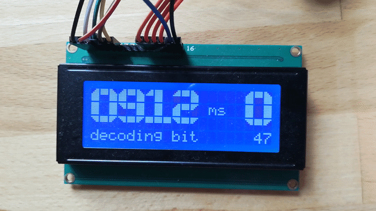
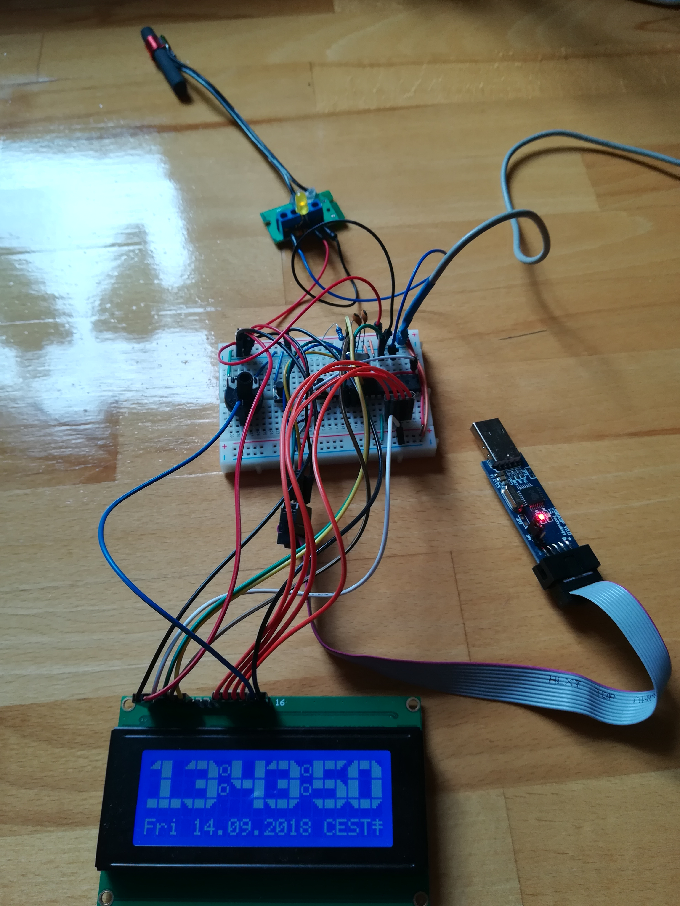

Receive, decode dcf77 signal and display date/time on hd44780 with atmega328 in plain C
==============

# Overview
A dcf77 avr project in plain C which uses avr-libc 2.0 and avr-gcc for compilation.
The target avr is an atmega328, the programmer an usbasp. Once the date and time is decoded
and the signal getting erroneous, the date and time is still available by means of a 1 second
timer interrupt. Whenever the signal is available and the all 58 bits can be decoded, the interrupt driven
date and time is synchronized with the dcf77 date and time. Most of the time the dcf77 signal is actually stable
thus the precise dcf77 date and time is shown on the 4x20 hd44780 display.
For displaying large symbols, each symbol is defined by blocks which are composed as large symbols.

# Schematic and Pins
[KiCad](http://kicad-pcb.org/) schematic will be soon available.

# Complete Setup

More detailed information will follow.

