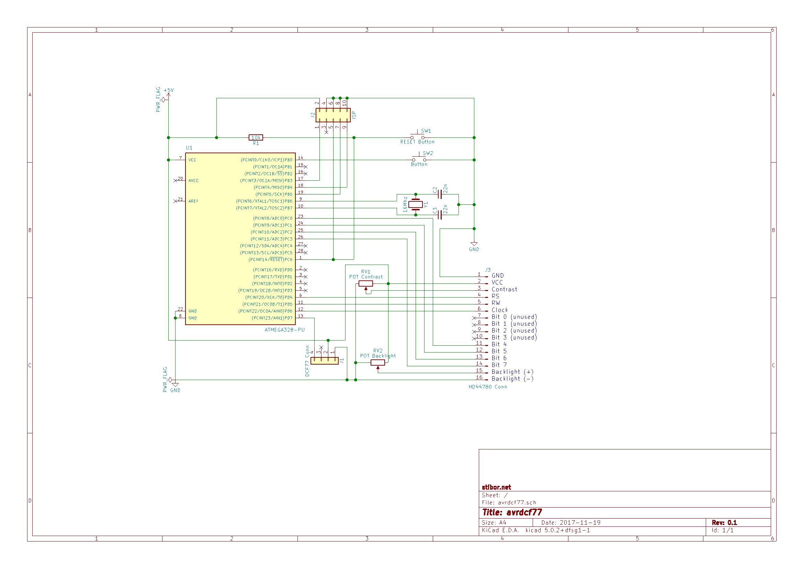

Receive, decode dcf77 signal and display date/time on hd44780 with atmega328 in ANSI C
==============

# Overview
Avrdcf77 is a project written in ANSI C which employs avr-libc 2.0 and avr-gcc to
decode the dcf77 signal and display date/time on a hd44780 LCD.
The target MCU is an atmega328, the programmer used is an [usbasp](https://www.fischl.de/usbasp/).
Whenever the dcf77 signal is available and all 58 bits can be decoded, the
date and time is synchronized with an internal struct variable which holds the date and time information.
If the signal is getting erroneous, then the date and time is still available by means of a
timer interrupt which updates each second the date and time information.
Most of the time the dcf77 signal is actually stable
thus the precise dcf77 date and time is shown on the 4x20 hd44780 display.
For displaying large symbols, each symbol is defined by blocks which are composed as large symbols.

# Schematic and Pins
[KiCad](http://kicad-pcb.org/) schematic [avrdcf77.zip](kicad/avrdcf77.zip)

# Complete Setup
Click on the image to see a video of avrdcf77.

